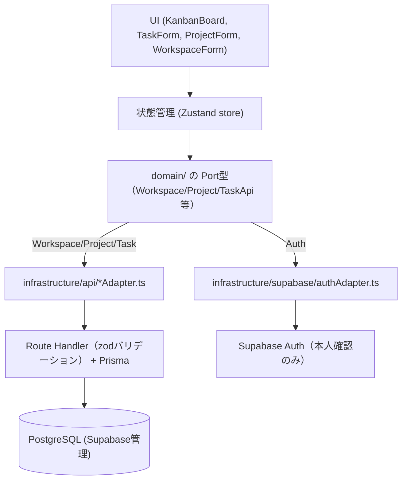

# taskflow — タスク管理アプリ

タスクをカード形式で管理し、ドラッグ＆ドロップでステータス（未着手 / 進行中 / 完了）を切り替えられるカンバンボードアプリです。  
エンタープライズ利用が可能なレベルのタスク管理SaaSを最終形として想定し、その最初のステップとして構築しています。

**公開URL**: https://taskflow.tsubokura.dev

## 主な機能

- タスクの作成・編集・削除
- ドラッグ＆ドロップによるステータス変更（`@dnd-kit`）
- PostgreSQL（Supabase管理）によるデータ永続化。

## 技術スタック

| レイヤー | 技術 |
| --- | --- |
| フロントエンド | Next.js 16 (App Router) / React 19 / TypeScript |
| 状態管理 | Zustand |
| ORM | prisma |
| バリデーション | zod |
| データベース | PostgreSQL (Supabase管理) |
| 認証 | Supabase Auth |
| ホスティング | Google Cloud Run（手動デプロイ） |

## アーキテクチャ

UIコンポーネントからDBアクセスの実装を直接呼ばず、Port（型の約束事、`domain/`）とAdapter（実装、`infrastructure/`）を分離しています。

## ディレクトリ構成

| パス | 説明 |
| --- | --- |
| app/ | Next.js App Router のエントリポイント・Route Handler |
| components/ | UIコンポーネント（KanbanBoard, TaskForm, TaskCard） |
| domain/ | Port（Task/Workspace/Project/AuthApiの型定義） |
| infrastructure/ | Adapter（Supabaseクライアント、TaskのPrisma経由Adapter） |
| store/ | Zustandによる状態管理・composition.ts |
| lib/ | Prismaクライアント・セッション検証・権限チェック・エラーハンドリング |
| lib/validation/ | zodによるRoute Handler向けバリデーションスキーマ |
| types/ | 型定義 |
